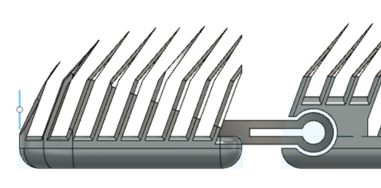
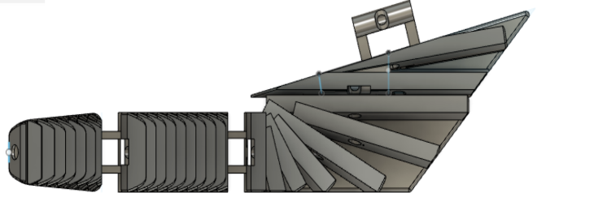
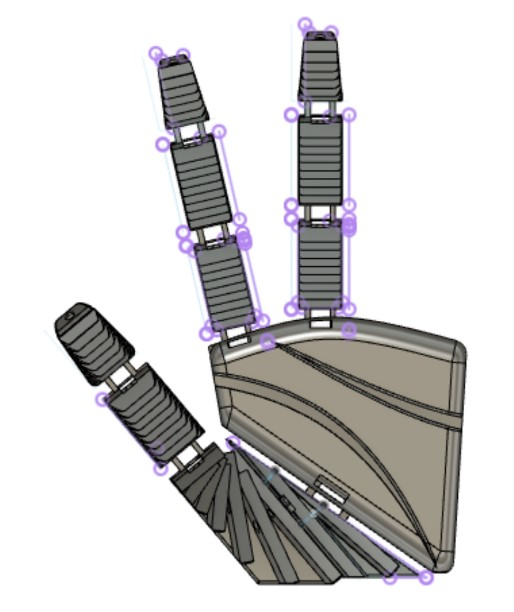
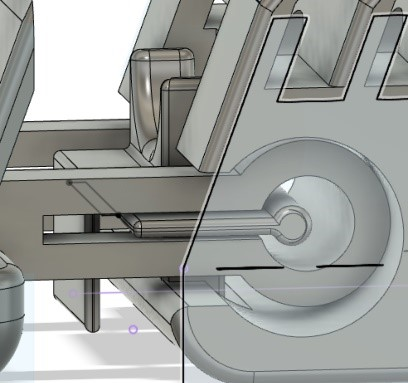
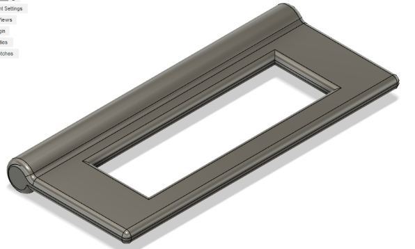
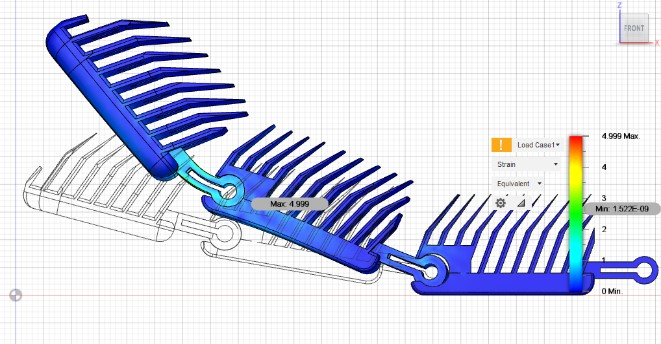
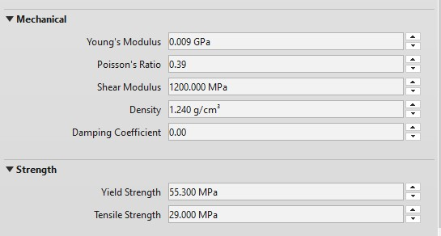
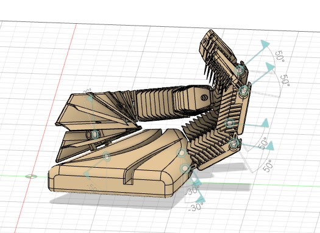
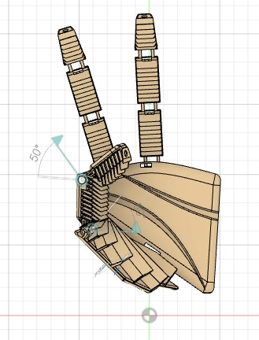
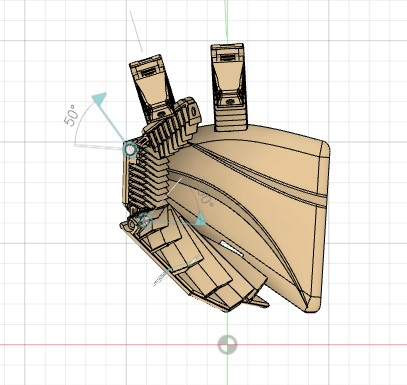

# Team-gama-hand

## Abstract
this repository shows the development of the upper limb arm. The general structure of this prosthetic arm treated as continuous improvement of the existing prosthetic arm. After a complete inspection of the essential elements and analysis of the available components.

This project consist of 5 important pillars which is a must for the project to be feasable possible to make.
1) CAD (Computer Aided Design) software for designing the hand as it was designed all from scratch to meet consumer demands
2) CAM (Computer Aided Manufaturing) which involves of manufacturing the product using a 3D printer and polyflex filament
3) FEA (Finite Element Analysis) this part involves the simulation of forces applied to the hand determining its mechanical properties
4) The use of flexible filament contributing as a part of soft mechanisms and materials resulting in flexible hand design which results in better grip of objects
5) Performing multiple strengh test such as compression and tesile test

This repository will show how to print the hand parts, assemble them and will showing some videos in simulationshowing how the hand function.

## Getting Started

### Prerequisites

3D Printer   
Polyflex (flexible) filament   
3 Servo motors   
3 Strings   
Arduino uno 

### Printing Instructions
Use the flexible polyflex-tpu95 filament which could be found here
https://polymaker.com/product/polyflex-tpu95/

This section is crusial for successfully printing 3D flexible hand using a 3D printer which is apart of CAM process.    

1) Loosen your idler before you start loading the filament  
2) Spread a thin layer of glue on your print surface so the printed object could be easily released when done  
3) print very slowly, safe speed is 20mm/s  
4) Filament should be dry as flexible filaments absorbs moisture
5) Set less dense infill depending on how soft you would like your hand to be the less infill the softer the hand will be 

For further and detailed instructions about printing flexible materials open this link  
https://blog.prusaprinters.org/how-to-print-with-flexible-filament_29672/

### Design 
Our robot hand's idea is to have flexibility and design each branch to separate and assemble.It has a wave structure for added grip and flexibility. The design was all done from scratch using CAD fusion 360 software.

Thumb design play a very important role in grabbing objects with other fingers and structures. so it has a special design.  

Our robot also chose this design to absorb the impact by increasing the flexibility of the part where the object touches thinner part to give it more flexibility.  

### Assembly 
This section we will show the assembly of the hand using pictures its main concept relies on the joint to assemble parts together showing how to lock the joints together.  

The lock in the figure below is inserted between the slots of the other joint.  

Every joint is inserted the same way and the process is repeated for the same parts onto the other joints until the rest of the hand is fully assembled.

## Simulation & Testing  
In this the designed hand is went through testing and simulation to determine the hand usability and specifications.  

The filament used for printing is PolyFlex (TPU95) which has specific mechanical properties which are fed into the simulation program determining and estimating the hand properties and usability. This is the part of FEA and tensile strengh testing of elastic materials which might be applied in application where soft robotics are needed.

the first test performed was the finger bending between the joints

material properties is set in simulation parameters

### Conclusion and further work 
 
extensive and well-explained figures, 

also links to supplementary material supporting your project on the last page after the references

share code, printable files, instructions and other material that helps document your project fully.

CAD (e.g. Autodesk Fusion 360)
2. CAM (e.g. 3D printing)
3. Finite Element Analysis (FEA)
5. Tensile/hardness testing
7. Soft mechanisms and materials
