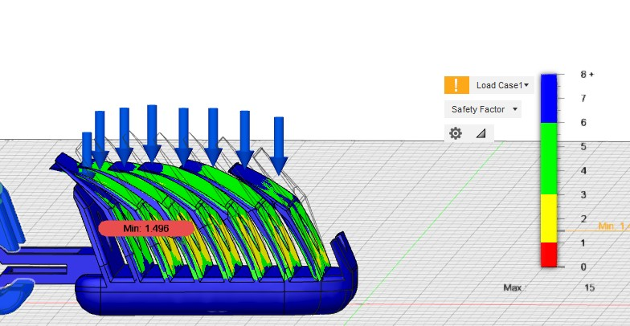

# Team-gama-hand

This repository will show how to print the hand parts, assemble them and will showing some videos in simulationshowing how the hand function

## Getting Started

### Prerequisites

3D Printer   
Polyflex (flexible) filament   
3 Servo motors   
3 Strings   

### Printing Instructions

### Design 

### Assembly 

### Simulation & Testing 
In this the designed hand will go through testing and simulation to determine the designed hand usability and specifications; determining its mechanical properties. The hand is designed to be able to be 3D printed using the flexible printing filament called PolyFlex (TPU95) [1]. TPU stands for thermoplastic polyurethane with 95 shore hardness, which is a measure of the hardness of flexible materials [2]. 
Such flexible materials yields different mechanical properties fro testing which requires extra modifications, special treatment and considerations to bare in mind. The first thing we might encounter with dealing with a flexible material is that it yields different mechanical properties unlike normal rigid nonflexible materials. Most normal materials has a ultimate tensile strength which is larger than yield strength, however in case of this flexible material it is the opposite yield strength is larger than ultimae tensile strength according to this book [3]. 
In general thermoplastic polyurethane mechanical property varies depending on its composites. The glass filled type is used in injection and moulding whih is simlar to 3D printing or additive manufacturing method which works by adding multiple layers over each forming the required shapr no matter how complex it is. So the properties of this material are obatined from this webpage [4], this website also stores most of the properties of all material usedi manufacturing also mentioning where you can obtain it from. The most important parameters in our simulation are ultimate tensile strength, yield strength, and Modulus of elasticity.  The 3D printing filament can be found and bought from this website including its mechanical properties, printing settings, and any additional notes [5]. The website only mentions the Modulus of elasticity, Ultimate tensile strength (UTS) and elongation break.  From these data and the data obtained from the materials website [4] we can deduce the material yield strength using linear interpolation these results are an estimate for the actual material as much as possible actual printing specifications might be different.

### Conclusion and further work 
 

list of requirements/description of demo setting.

extensive and well-explained figures, 

also links to supplementary material supporting your project on the last page after the references

share code, printable files, instructions and other material that helps document your project fully.

CAD (e.g. Autodesk Fusion 360)
2. CAM (e.g. 3D printing)
3. Finite Element Analysis (FEA)
5. Tensile/hardness testing
7. Soft mechanisms and materials
